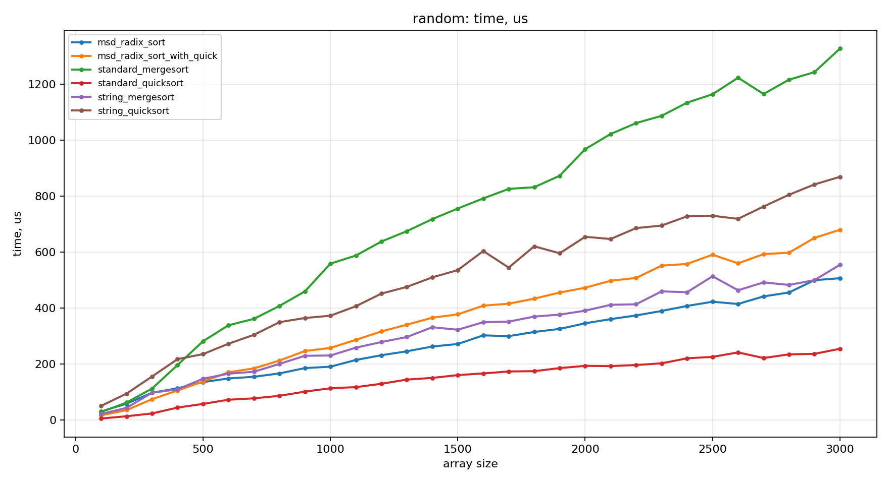
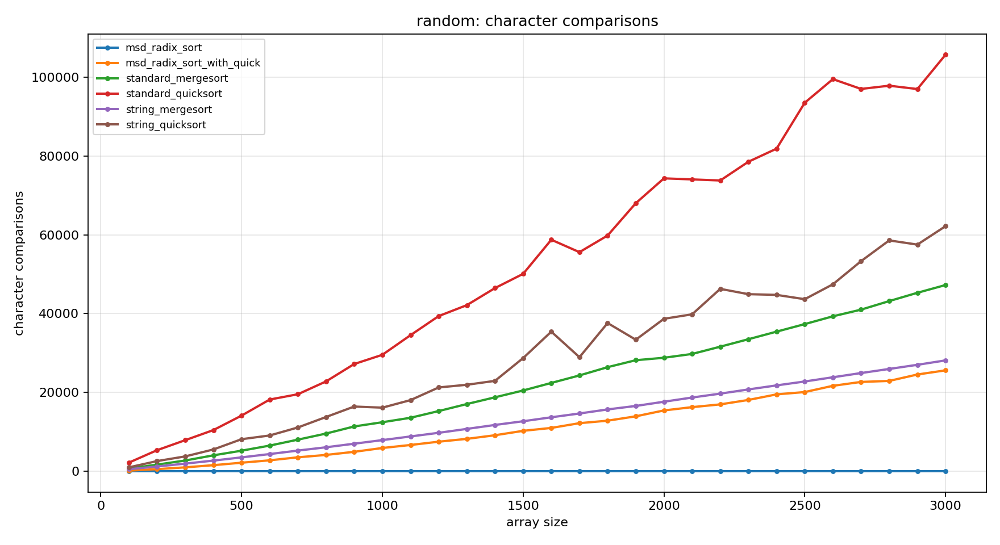
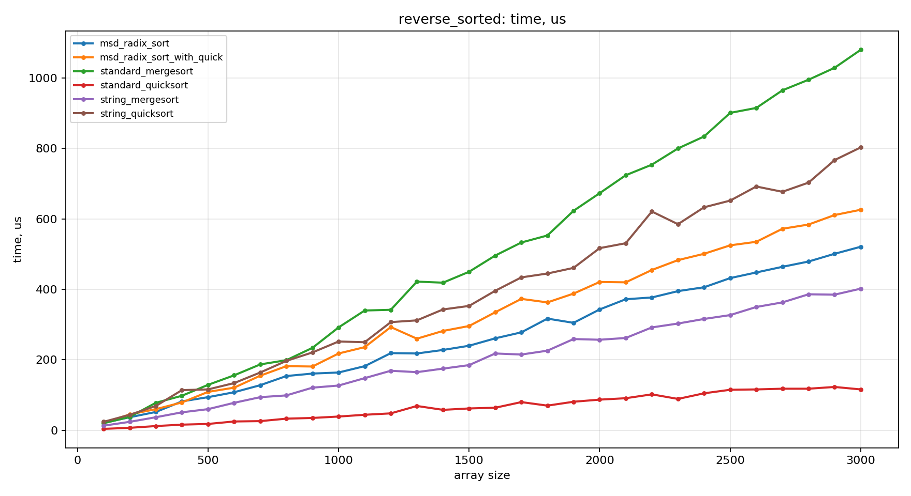
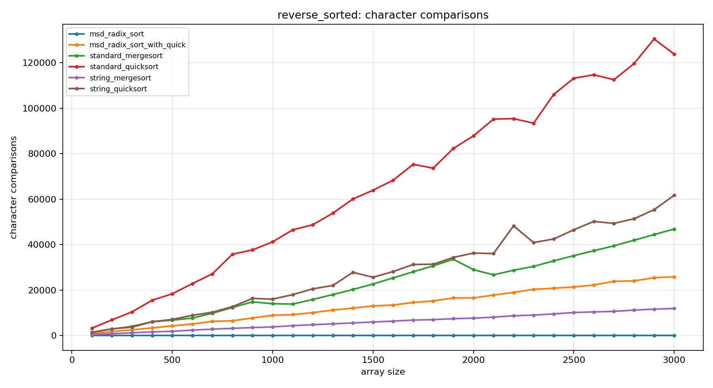
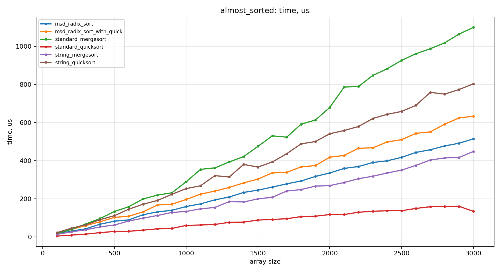
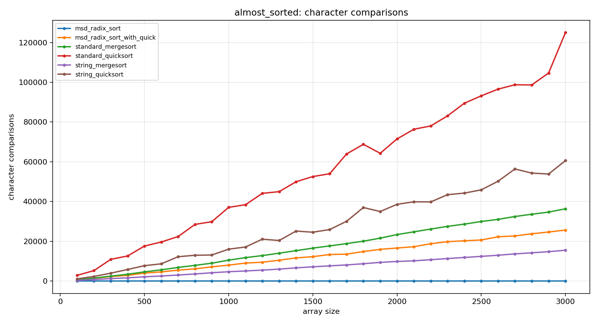

# aads_set9

## Посылки
`A1m - 375971951`

`A1q - 375971514`

`A1r - 375975215`

`A1rq - 375975286`

## Сборка и запуск
```bash
g++ -std=c++17 -O2 src/*.cpp -Iinclude -Isrc -o main
./main
```

Выходные данные:
- `data/results.csv`

## Графики
```bash
python3 plots/plot_results.py
```

Результаты сохраняются в `png/`.








## Отчет

### Анализ графиков
Графики показывают, что адаптированные под строки алгоритмы обычно делают
меньше посимвольных сравнений, чем стандартные сортировки. При этом по времени
они могут проигрывать из-за возможной не самой
оптимальной реализации.

### Параметры эксперимента (в `src/main.cpp`)
- `max_size = 3000`
- шаг размера массива: `100`
- длина строки: от `10` до `200`
- seed генератора: `20260524`
